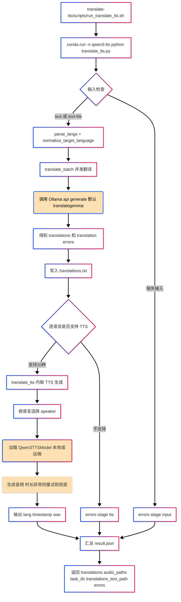

# hello-skills（translate-tts / ncm-to-wav）

这里有两个独立 skill：

- `translate-tts`：中文翻译后生成多语种语音（translate + TTS）。
- `ncm-to-wav`：网易云 `.ncm` 批量转 `.wav`。

两者是并列关系，不存在先后顺序依赖。

## translate-tts

基于 `translate-tts/scripts/` 的真实实现，`translate-tts` 的主流程是：先把中文并发翻译到多个目标语言，再按语言调用 Qwen3-TTS 逐条生成音频。

## 原理图（Implementation-Based）



## 关键实现点

- 翻译层：`translate_tts.py` 内置并发翻译（`ThreadPoolExecutor`）并调用 Ollama。
- TTS 层：`translate_tts.py` 内联执行多语种 TTS，单语言失败不阻断其他语言。
- 语言支持：
  - 翻译支持更多语言别名（含阿拉伯语、印地语、泰语、越南语等）。
  - TTS 支持 10 种语言（中文/英文/法语/德语/俄语/意大利语/西班牙语/葡萄牙语/日语/韩语）。
- 输出目录默认：`~/Downloads/translate_tts/<YYYYmmdd_HHMMSS_mmm>/`
  - `translations.txt`
  - `result.json`
  - `*.wav`

## 相关脚本

- `translate-tts/scripts/translate_tts.py`：主流程（翻译 + TTS）
- `translate-tts/scripts/run_translate_tts.sh`：Bash 启动入口

## ncm-to-wav（独立 Skill）

核心脚本：

- `ncm-to-wav/scripts/ncm_to_wav.sh`

快速用法：

```bash
SKILL_ROOT="${CODEX_HOME:-$HOME/.codex}/skills/ncm-to-wav"
bash "$SKILL_ROOT/scripts/ncm_to_wav.sh" \
  -i "$HOME/Music/网易云音乐"
```

可选参数：

- `-o, --output`：输出到指定目录（保持原目录结构）。
- `-f, --force`：覆盖已有 wav。
- `--delete-source`：转换成功后删除源 ncm。
