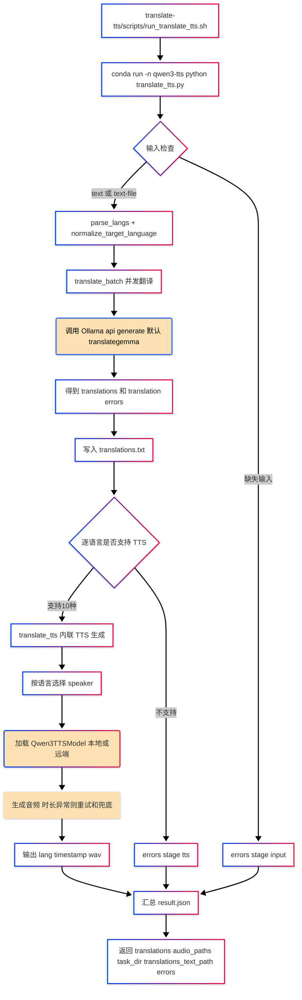

# hello-skills (translate-tts / ncm-to-wav / toolcheck)

本项目是一系列为 AI Agent（如 Gemini CLI、Codex、Claude）设计的“技能（Skills）”集合。每个技能都是独立的，通过脚本和 `SKILL.md` 定义其功能。

## 技能列表

- **`translate-tts`**：中文翻译后生成多语种语音（Translation + TTS）。
- **`ncm-to-wav`**：网易云 `.ncm` 格式批量转换为 `.wav`。
- **`toolcheck`**：开发工具链诊断，扫描版本冲突、缺失和更新建议。

---

## 1. translate-tts

基于 `translate-tts/scripts/` 实现，主流程：先把中文并发翻译到多个目标语言，再按语言调用 Qwen3-TTS 逐条生成音频。

### 原理图 (Mermaid)



### 关键点
- **翻译层**：内置并发翻译（`ThreadPoolExecutor`），调用 Ollama。
- **TTS 层**：内联执行多语种 TTS，支持 10 种语言（中/英/法/德/俄/意/西/葡/日/韩）。
- **输出**：默认保存至 `~/Downloads/translate_tts/`。

---

## 2. ncm-to-wav

用于网易云音乐缓存文件 `.ncm` 的批量解码。

### 快速用法
```bash
# 假设技能根目录已确定
bash ncm-to-wav/scripts/ncm_to_wav.sh -i "~/Music/网易云音乐"
```

### 可选参数
- `-o, --output`：指定输出目录。
- `-f, --force`：强制覆盖。
- `--delete-source`：转换成功后删除原文件。

---

## 3. toolcheck

开发工具链扫描器，支持扫描 25 种常用开发工具（Python, Node, Go, Rust, Java 等）。

### 快速用法
```bash
bash toolcheck/scripts/toolcheck.sh
```

### 功能
- 检查本地版本与最新版本的差异。
- 识别重复安装或过期工具。
- 生成 Markdown 表格报告。

---

## 项目规范
- **指令上下文**：项目根目录下的 `GEMINI.md` 提供了 AI Agent 使用此仓库的详细指令。
- **技能元数据**：每个子目录必须包含 `SKILL.md` 以定义触发规则和范围边界。
- **环境要求**：Python 技能通常需要特定的 Conda 环境（如 `qwen3-tts`）。
