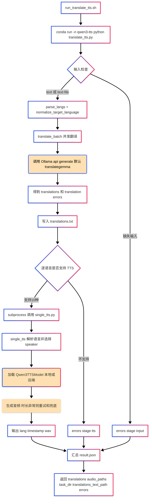

# translate-tts

基于本目录 `scripts/` 的真实实现，`translate-tts` 的主流程是：
先把中文并发翻译到多个目标语言，再按语言调用 Qwen3-TTS 逐条生成音频。

## 原理图（Implementation-Based）

## 关键实现点

- 翻译层：`translate_only.py` 使用 `ThreadPoolExecutor` 并发调用 Ollama。
- TTS 层：`translate_tts.py` 对每种语言单独调用 `single_tts.py`，失败不阻断其他语言。
- 语言支持：
  - 翻译支持更多语言别名（含阿拉伯语、印地语、泰语、越南语等）。
  - TTS 仅支持 `single_tts.py` 中的 10 种语言（中文/英文/法语/德语/俄语/意大利语/西班牙语/葡萄牙语/日语/韩语）。
- 输出目录默认：`~/Downloads/translate_tts/<YYYYmmdd_HHMMSS_mmm>/`
  - `translations.txt`
  - `result.json`
  - `*.wav`

## 相关脚本

- `scripts/translate_tts.py`：主流程（翻译 + TTS）
- `scripts/translate_only.py`：翻译实现
- `scripts/single_tts.py`：单条 TTS 实现
- `scripts/run_translate_tts.sh`：Bash 启动入口
