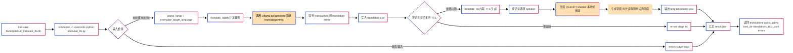

# hello-skills

本项目是一系列为 AI Agent（如 Claude Code、Gemini CLI、Codex）设计的”技能（Skills）”集合。每个技能都是独立的，通过脚本和 `SKILL.md` 定义其功能。

## 技能列表

- **`toolcheck`**：开发工具链诊断，扫描 25 种常用工具的版本冲突、重复安装、过期版本和配置文件审计。
- **`translate-tts`**：中文翻译后生成多语种语音（Translation + TTS），支持 10 种语言。
- **`ncm-to-wav`**：网易云 `.ncm` 格式批量转换为 `.wav`。
- **`call-graph-image`**：分析 Python 项目的方法级调用图，生成 GPT-image-2 提示词，输出建筑蓝图风格的架构拓扑图。

---

## 1. translate-tts

基于 `translate-tts/scripts/` 实现，主流程：先把中文并发翻译到多个目标语言，再按语言调用 Qwen3-TTS 逐条生成音频。

### 原理图 (Mermaid)


```mermaid
---
config:
  layout: dagre
  theme: neo
  look: neo
---
flowchart LR
    A["translate-tts/scripts/run_translate_tts.sh"] --> B["conda run -n qwen3-tts python translate_tts.py"]
    B --> C{"输入检查"}
    C -- "text 或 text-file" --> D["parse_langs + normalize_target_language"]
    C -- 缺失输入 --> X1["errors stage input"]
    D --> E["translate_batch 并发翻译"]
    E --> F["调用 Ollama api generate 默认 translategemma"]
    F --> G["得到 translations 和 translation errors"]
    G --> H["写入 translations.txt"]
    H --> I{"逐语言是否支持 TTS"}
    I -- 支持10种 --> J["translate_tts 内联 TTS 生成"]
    I -- 不支持 --> X2["errors stage tts"]
    J --> K["按语言选择 speaker"]
    K --> L["加载 Qwen3TTSModel 本地或远端"]
    L --> M["生成音频 时长异常则重试和兜底"]
    M --> N["输出 lang timestamp wav"]
    N --> O["汇总 result.json"]
    X1 --> O
    X2 --> O
    O --> P["返回 translations audio_paths task_dir translations_text_path errors"]

    F@{ shape: rounded}
    L@{ shape: rounded}
    M@{ shape: rounded}
    style F stroke:#2962FF,fill:#FFE0B2,color:#000000
    style L fill:#FFE0B2
    style M stroke:#FFE0B2,fill:#FFE0B2
```

### 关键点
- **翻译层**：内置并发翻译（`ThreadPoolExecutor`），调用 Ollama。
- **TTS 层**：内联执行多语种 TTS，支持 10 种语言（中/英/法/德/俄/意/西/葡/日/韩）。
- **输出**：默认保存至 `~/Downloads/translate_tts/`。

---

## 2. ncm-to-wav

用于网易云音乐缓存文件 `.ncm` 的批量解码。

### 快速用法
```bash
# 假设技能根目录已确定
bash ncm-to-wav/scripts/ncm_to_wav.sh -i "~/Music/网易云音乐"
```

### 可选参数
- `-o, --output`：指定输出目录。
- `-f, --force`：强制覆盖。
- `--delete-source`：转换成功后删除原文件。

---

## 3. toolcheck

开发工具链扫描器，支持扫描 25 种常用开发工具（Python, Node, Go, Rust, Java, Swift, PHP, Dart, Flutter, Claude, Gemini CLI 等）。

### 快速用法
```bash
# macOS / Linux
bash toolcheck/scripts/toolcheck.sh

# Windows PowerShell
pwsh -ExecutionPolicy Bypass -File toolcheck/scripts/toolcheck.ps1
```

### 功能
- 检查本地版本与最新版本的差异（通过 Homebrew、GitHub Releases、winget 等）。
- 识别重复安装（自动标注保留/移除建议）。
- 检测过期工具并生成升级命令。
- 审计 Shell 配置文件（`~/.zshrc`、`~/.bashrc` 等）中的硬编码版本路径。
- 生成 Markdown 表格报告，按状态分组排序。

### 报告输出
报告保存在 `~/toolcheck/report_MMdd_HHmmss.md`，包含 8 列表格：
- 序号 / 工具 / 状态 / 本地版本 / 本地安装路径 / 最新版本 / 操作 / 备注

状态优先级：⚠ 重复 → ⚠ 过期 → ✓ 正常 → — 不适用 → ✗ 缺失

---

## 4. call-graph-image

Python 项目调用图可视化工具，生成建筑蓝图风格的架构拓扑图。

### 快速用法
在任意 Python 项目根目录下，调用 AI Agent 的 `/call-graph-image` 技能。

### 功能
- 自动检测项目类型（Web 服务、库/SDK、CLI 工具、数据管道）。
- 识别入口点（路由处理器、公共 API、命令处理器、任务定义）。
- 追踪方法级调用图（最大深度 6 层）。
- 分层分类（Entry、Core、Data、Util、External）。
- 生成 GPT-image-2 提示词，输出手绘水彩风格的技术蓝图。

### 输出风格
- 背景：温暖的米白色纸张，带有纤维纹理和轻微老化痕迹。
- 元素：精细的墨线轮廓 + 柔和的水彩填充。
- 布局：从左到右的垂直泳道，代表架构层次。
- 配色：靛蓝（Entry）、鼠尾草绿（Core）、赭石（Data）、暖灰（Util）、梅紫（External）。

---

## 项目规范

### 目录结构
- 每个技能目录必须包含：
  - `SKILL.md`：YAML frontmatter（`name`、`description`）+ Markdown 正文
  - `scripts/`：可执行的 Bash/Python 脚本
- 技能目录使用 kebab-case 命名（如 `translate-tts`）
- 辅助脚本按动作命名（如 `run_translate_tts.sh`）

### 指令上下文
- `CLAUDE.md`：Claude Code 的项目指令
- `GEMINI.md`：Gemini CLI 的项目指令
- `AGENTS.md`：通用 AI Agent 的仓库指南
- `get_latest.md`：每种工具获取最新版本的标准方式

### 环境要求
- **Python 技能**：通常需要特定的 Conda 环境（如 `qwen3-tts`）
- **Bash 脚本**：使用 `#!/usr/bin/env bash` 和 `set -euo pipefail`
- **跨平台支持**：toolcheck 同时支持 macOS/Linux（Bash）和 Windows（PowerShell）

### 技能发现
技能通过符号链接安装到 `~/.claude/skills/` 供 Claude Code 发现。打包使用 skill-creator 工具链：
```bash
python3 ~/.claude/skills/skill-creator/scripts/init_skill.py <name> --path .
python3 ~/.claude/skills/skill-creator/scripts/package_skill.py ./<name>
```

### 提交规范
- 使用短主题行，带前缀类型：`feat:`、`fix:`、`refactor:`
- 祈使语气
- 提交时使用对应工具的身份标识（见 `AGENTS.md`）
