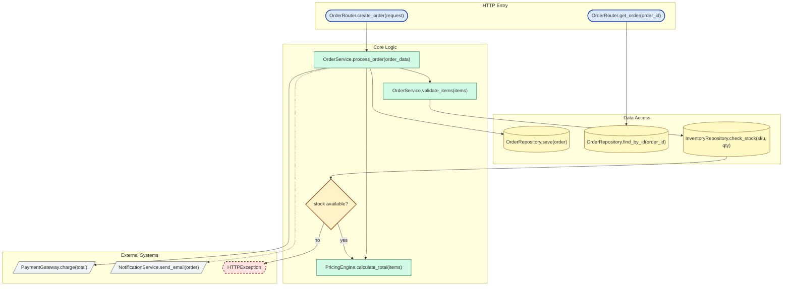

# Example Output

Below is a shortened example of what the skill produces when run against a small
FastAPI order service.

---

## Section 1: Mermaid Diagram

Save as .mmd file. Render with mermaid.live, VS Code plugin, or mmdc CLI.

## Section 2: GPT-image-2 Prompt

Paste directly into GPT-image-2. Best at 1792x1024 or higher.

Create a hand-crafted architectural blueprint illustration of a software system
execution flow.

The system architecture (show exactly these nodes as a directed graph):

1. Create Order Route - receives the order request from FastAPI
2. Get Order Route - fetches an existing order by ID
3. Process Order - orchestrates validation, pricing, payment, persistence, and notification
4. Validate Items - checks item availability before accepting the order
5. Stock Decision - branches on whether requested inventory is available
6. Pricing Engine - calculates the final order total
7. Payment Gateway - external payment boundary for charging the customer
8. Order Repository - stores and retrieves order records
9. Inventory Repository - reads stock levels for each requested SKU
10. Notification Service - sends the confirmation email asynchronously
11. HTTP Error - returned when validation fails

[CONNECTIONS - describe directed edges]
1 to 3: create-order request enters orchestration
2 to 8: get-order request reads persisted order data
3 to 4: process order validates items first
4 to 9: validation checks inventory
9 to 5: stock result drives the branch
5 to 6: available stock continues to pricing
5 to 11: missing stock returns an HTTP error
6 to 7: calculated total is charged
7 to 8: successful payment allows order persistence
3 to 10: order confirmation is sent asynchronously

[BRANCHING - key decision points]
- At node 5: stock available continues to node 6; stock unavailable goes to node 11

[LOOP]
- No recurring control-flow loop is present in this small service.

Visual style:
- Canvas: Warm off-white cream paper with subtle fiber texture and gentle aging
- Technique: Hand-drawn ink outlines with soft watercolor wash fills
- Aesthetic: Renaissance engineer notebook meets modern information design
- Node colors: Entry=indigo wash, Logic=sage green wash, Decision=amber wash, IO=rose wash, External=warm grey wash, Data=cream/gold wash
- Connections: Elegant bezier curves with hand-drawn arrowheads, condition labels in small italic
- Layout: Top-to-bottom flow, branching side-by-side, loop-back as graceful teal arc only if a loop exists
- Title: "Order Service - Architecture Overview" in calligraphic hand-lettering at top
- Legend: Bottom-right, miniature node samples with color labels
- Quality: Museum-exhibition-grade technical illustration, generous whitespace, golden-ratio spacing

IMPORTANT: Each node must display its label text clearly and legibly. Keep the
diagram clean and readable. Prioritize beauty and clarity over completeness.
